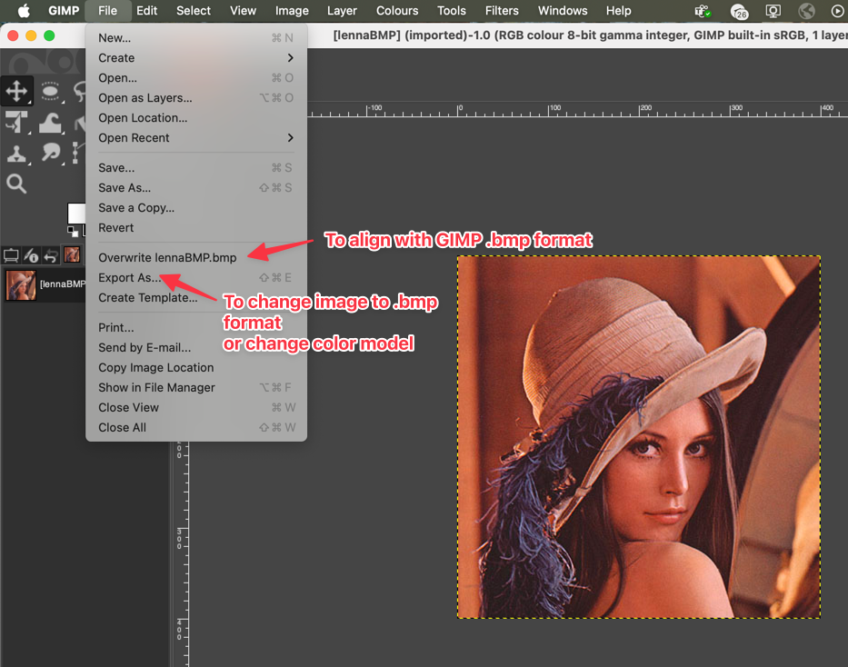
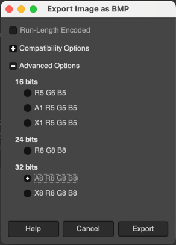
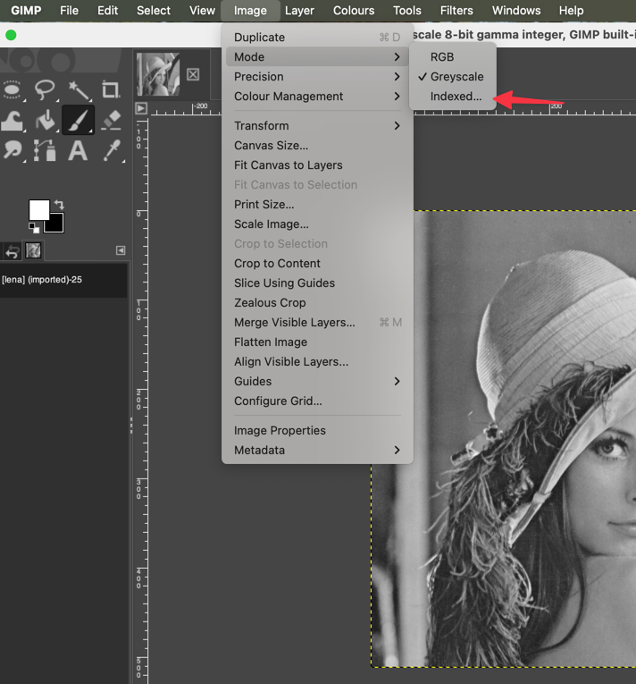
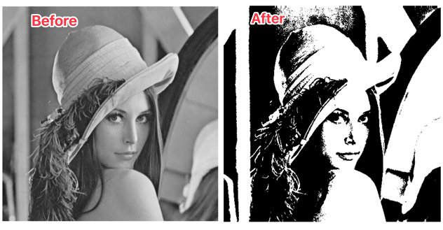

# fast-bmp

<h3 align="center">

  <a href="https://www.zakodium.com">
    
  </a>

  <p>
    Maintained by <a href="https://www.zakodium.com">Zakodium</a>
  </p>

[![NPM version][npm-image]][npm-url]
[![Test coverage][codecov-image]][codecov-url]
[![npm download][download-image]][download-url]

</h3>

A library for encoding and decoding bmp image file format.
References:

- [Wikipedia BMP format page](https://en.wikipedia.org/wiki/BMP_file_format)
- [Microsoft BMPV5 format page](https://learn.microsoft.com/en-us/windows/win32/api/wingdi/ns-wingdi-bitmapv5header)

# Supported features

This library only supports V5 headers.

- binary (1-bit per pixel)
- greyscale (8-bits per pixel)
- RGB (24-bits per pixel)
- RGBA (32-bits per pixel)

# Usage

## Encoding

```js
import { encode } from 'fast-bmp';

// 0 0 0 0 0
// 0 1 1 1 0
// 0 1 0 1 0
// 0 1 1 1 0
// 0 0 0 0 0
const data = new Uint8Array([
  0, 0, 0, 0, 0, 0, 1, 1, 1, 0, 0, 1, 0, 1, 0, 0, 1, 1, 1, 0, 0, 0, 0, 0, 0,
]);
const imageData = {
  width: 5,
  height: 5,
  data,
  bitsPerPixel: 1,
  components: 1,
  channels: 1,
};
// Encode returns a Uint8Array.
const encoded = encode(imageData);
fs.writeFileSync('image.bmp', encoded);
```

## Decoding

```ts
import { decode } from 'fast-bmp';

// 0 0 0 0 0
// 0 1 1 1 0
// 0 1 0 1 0
// 0 1 1 1 0
// 0 0 0 0 0
const buffer = fs.writeFileSync('image.bmp');
const imageData = decode(buffer);
/* Returns object:
{
width: 5,
height: 5,
data: new Uint8Array([
    0, 0, 0, 0, 0, 
    0, 1, 1, 1, 0, 
    0, 1, 0, 1, 0, 
    0, 1, 1, 1, 0, 
    0, 0, 0, 0, 0,
  ]),
bitsPerPixel: 1,
components: 1,
channels: 1,
colorMasks: [0x00ff0000, 0x0000ff00, 0x000000ff],
compression: 0,
xPixelsPerMeter: 2835,
yPixelsPerMeter: 2835,
}
*/
```

# Generating images

**Used version**: GIMP 2.10.43 (version 3)

`fast-bmp` used GIMP to generate images for testing decoding/encoding results.
To generate images, open an image of interest in GIMP.

If the file is already in `.bmp` format, to align them with GIMP format go to `File`->`Overwrite <image_name.bmp>`.It will make the same
image but encoded as GIMP `.bmp`.



However, if an image you want to test is of different format, go to `File`->`Export As..`. In the "Name" input box change the extension to `.bmp`. You can choose the location of where
the image will be exported.

After clicking on `Export`, a window will appear. There, _do not modify_ `Run-Length Encoding` and `Compatibility Options`.
In `Advanced options` you can select the color model of an exported image.

A number next to the letter represents the number of pixels that is allocated for this channel.
So, for example, `R5 G6 B5` means that there are 5 bits for red channel, 6 for green and 5 for blue. `X` represents an unused channel, which means that `RGBX` is still an `RGB` image with padding. `A` stands for [alpha-channel](https://en.wikipedia.org/wiki/Alpha_compositing).
Careful, `fast-bmp` does not support all color models. Check supported features [here](#supported-features).

Click `Export` and you will get a `.bmp` image aligned with GIMP format.



## Generating 1 bit images


To generate binary images you need to open an image with GIMP, go to `Image`->`Mode` and click on `Indexed..`



There, you need to choose `Use black and white (1 bit) palette` and click `Convert`.


From there, export it as `.bmp` like any other image.



[npm-image]: https://img.shields.io/npm/v/fast-bmp.svg?style=flat-square
[npm-url]: https://www.npmjs.com/package/fast-bmp
[codecov-image]: https://img.shields.io/codecov/c/github/image-js/fast-bmp.svg?style=flat-square
[codecov-url]: https://codecov.io/gh/image-js/fast-bmp
[download-image]: https://img.shields.io/npm/dm/fast-bmp.svg?style=flat-square
[download-url]: https://www.npmjs.com/package/fast-bmp
