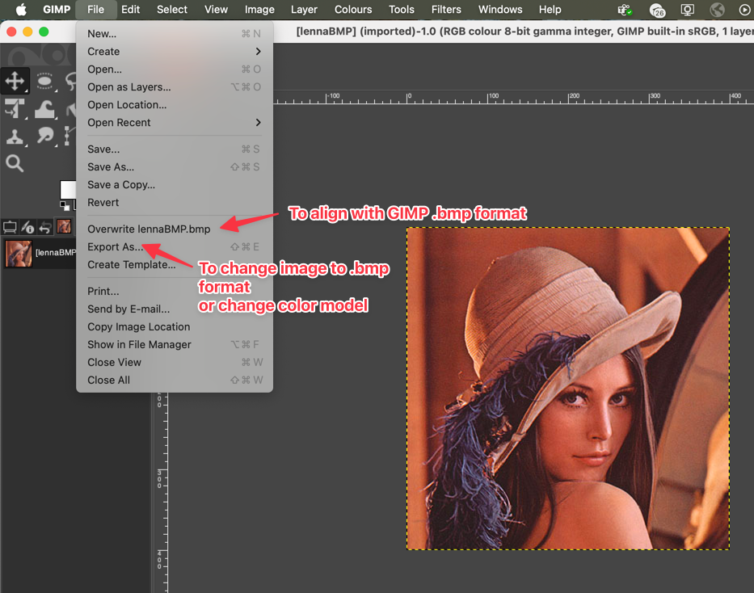
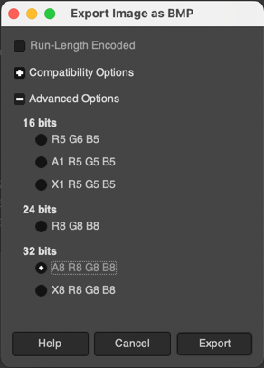
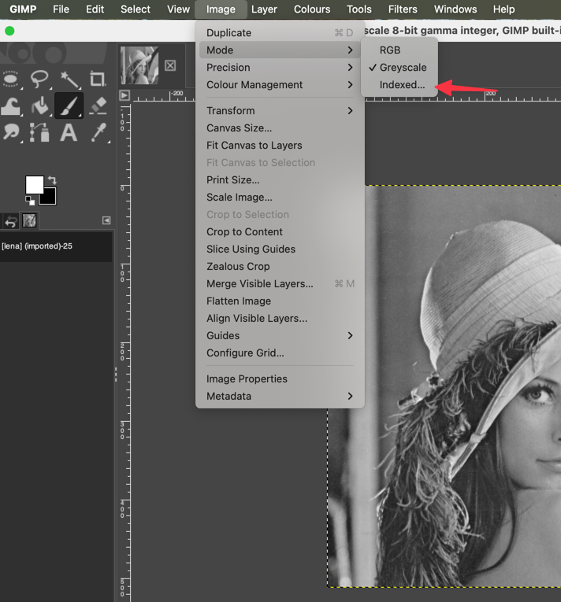
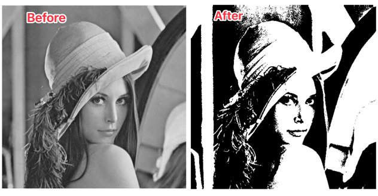

# Generating images

**Used version**: GIMP 2.10.43 (version 3)

`fast-bmp` used GIMP to generate images for testing decoding/encoding results.
To generate images, open an image of interest in GIMP.

If the file is already in `.bmp` format, to align them with GIMP format go to `File`->`Overwrite <image_name.bmp>`.It will make the same
image but encoded as GIMP `.bmp`.

However, if an image you want to test is of different format, go to `File`->`Export As..`. In the "Name" input box change the extension to `.bmp`. You can choose the location of where
the image will be exported.

After clicking on `Export`, a window will appear. There, _do not modify_ `Run-Length Encoding` and `Compatibility Options`.
In `Advanced options` you can select the color model of an exported image.

A number next to the letter represents the number of pixels that is allocated for this channel.
So, for example, `R5 G6 B5` means that there are 5 bits for red channel, 6 for green and 5 for blue. `X` represents an unused channel, which means that `RGBX` is still an `RGB` image with padding. `A` stands for [alpha-channel](https://en.wikipedia.org/wiki/Alpha_compositing).
Careful, `fast-bmp` does not support all color models. Check supported features [here](#supported-features).

Click `Export` and you will get a `.bmp` image aligned with GIMP format.

## Generating 1 bit images

To generate binary images you need to open an image with GIMP, go to `Image`->`Mode` and click on `Indexed..`

There, you need to choose `Use black and white (1 bit) palette` and click `Convert`.

From there, export it as `.bmp` like any other image.

